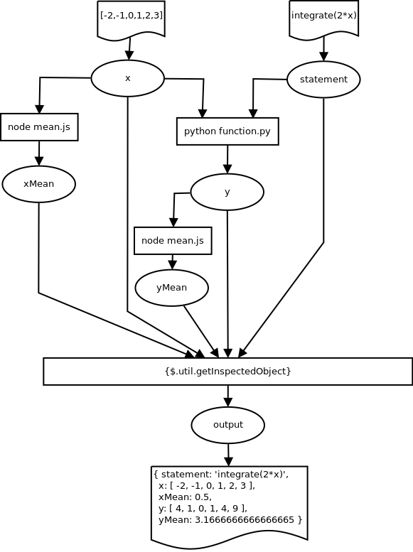
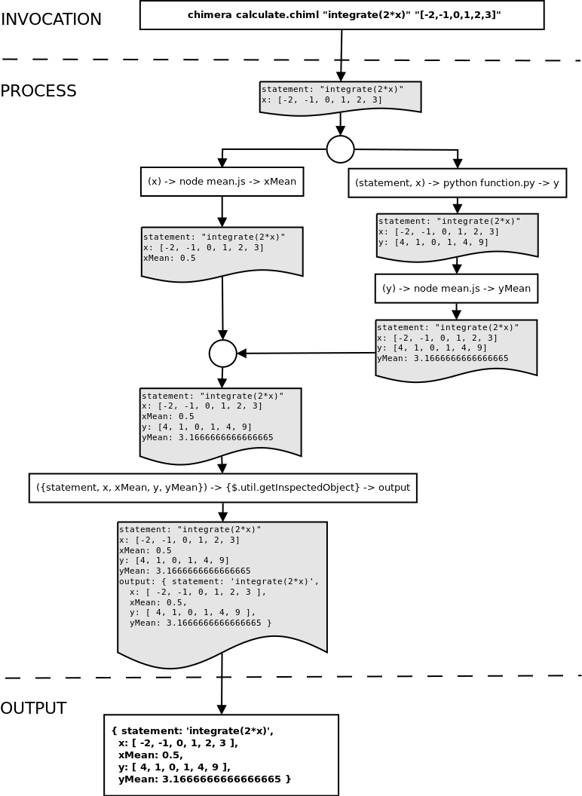

<h1 align="center">Chimera-Framework</h1>

<div align="center">
  
</div>
<br />
<div align="center">
  <strong>Language Agnostic Framework for Stand-alone and Distributed Computing</strong>
</div>
<br />

[](https://standardjs.com)
[](https://codecov.io/gh/goFrendiAsgard/chimera-framework)

Chimera-framework is a language agnostic framework for standalone and distributed computing. Chimera-framework is written in `Node.Js`. As a component based software engineering framework, Chimera-framework allows you to orchestrate several components to achieve a greater goal. The components can be written in any programming language. Executable binary file can also act as component.

# Why Chimera-Framework?

* __Programming Language Diversity:__ Some programming language are good at machine learning. Some others are good at statistics or web development. Creating a website with some machine-learning/statistics feature will lead you to a soon-to-be-regret decision. Chimera-framework solve this by let you choose the best programming language for each task.

* __CLI Support in Most Programming Language:__ Most programming language supporting command line interface. So, rather than inventing a new bridging interface, Chimera-framework simply use this already-popular-and-common interface. Thus, you don't need to learn something new in order to write your component.

* __Technology Migration in Tight Deadline is Painful:__ In software development, there is one single hell named vendor-lock. And to make it worse, some frameworks (or even programming languages) can suddenly fade away from the market. Chimera-framework help you prevent this by let you develop component-based software. So, if your components suddenly doesn't work due to deprecation or anything, you can just simply drop in a new replacement without any need to rewrite the entire software.

# Installation

Using npm (You should have `Node.Js` and `npm` installed):
```sh
npm install --global chimera-framework
```
This method is recommended for framework user

Using git (You should have `Node.Js`, `npm`, and `git client` installed):
```sh
git clone git@github.com:goFrendiAsgard/chimera-framework.git
cd chimera-framework
npm install --global
npm link
```
This method is recommended for framework tester/developer

# Update

Using npm:
```
npm update --global chimera-framework
```

Using git
```sh
cd chimera-frameowork
git pull origin master
npm install --global
npm link
```

# Dependencies

* Node.Js
* npm
* Interpreters/Compilers, depend on programming language you use.

# Testing

To perform the test, you can invoke `npm test`. A `g++` compiler is required for some test-case.

# Example

## Stand-Alone-Computing

Given `y = f(x) = integrate(2*x)` and `x = {-2, -1, 0, 1, 2, 3}`, you want to make a program to calculate:

* `y`
* `mean of x`
* `mean of y`

The user should be able to change the value of `x` and `f(x)` as needed.

Suppose you are a `Node.Js` developer, and you mainly works with Javascript. You know how to do most thing in `Javascript`, but you can't find any `npm` package that can solve `integral` problem as good as [Sympy](http://www.sympy.org/en/index.html) which is a `Python` package.

You can learn Python in a day or two, but the deadline is tomorrow and you don't want to waste your time learning a new programming language *(__PS:__ This is just a simple use-case, in real life, I love `Python` and I will recommend you to try this awesome language, especially if you do a lot of machine-learning thing)*

Your program should contains at least two inputs:
* `statement`: a string containing the mathematical formula of `f(x)`.
* `x`: an array containing the data.

You want to calculate the value of `y` by using `Python` because that is the only one to use `sympy` and you don't have enough time to create the same thing in `Javascript`

But, to calculate `mean of x` and `mean of y` you want to use `Javascript`. You are pretty sure that you only need two beautiful `Javascript` code in order to get the `mean` of an array. *(__PS:__ Yes, Python can do the same, but for now, let's pretend you don't know. Remember, you are a Javascript developer, and you have snake-phobia)*

### First Problem: calculate y

First of all, you make a `Python` script to solve the `f(x)` and get the value of `y`. You name the script as `function.py` and the script is as follow:

```Python
import sys, json
from sympy import *

def f(statement, data):
    x = symbols('x')
    fn = str(eval(statement))
    y = []
    for x in data:
        y.append(eval(fn))
    return y

if __name__ == '__main__':
    statement = sys.argv[1]
    data = json.loads(sys.argv[2])
    print(json.dumps(f(statement, data)))
```

Someone told you that `integrate(2*x)` is `x^2`. By using this information, you know that if `y = f(x) = integrate(2*x) = x^2` and `x = {-2, -1, 0, 1, 2, 3}`, then `y` must be `{4, 1, 0, 1, 4, 9}`.

Just to make sure that your program is correct, you then invoke this in your `terminal`:
```
gofrendi@minastirith:~$ python function.py "integrate(2*x)" "[-2,-1,0,1,2,3]"
[4, 1, 0, 1, 4, 9]
```

And wow, it works. You don't really know how, but it works and it makes you happy :). *(__PS:__ Don't feel bad if you don't understand how the code works, I'm a computer engineering teacher, and I don't know how sympy exactly works. For now it's just magical, let's inspect it later)*

### Second Problem: calculate mean

Now, you are ready to do the next step. Calculate mean of an array. So, you make a `Javascript` code, name it as `mean.js`, and write this:

```Javascript
module.exports = mean

function mean (data) {
  let total = data.reduce((total, num) => { return total + num })
  return parseFloat(total) / data.length
}

if (require.main === module) {
  let data = JSON.parse(process.argv[2])
  console.log(mean(data))
}
```

You are pretty sure it's going to work, and it's not as magical as solving the integral. But as you always happy seeing your program works, you open your terminal, and type this:
```
gofrendi@minastirith:~$ node mean.js "[4,1,0,1,4,9]"
3.1666666666666665
```
And again, you got the right answer.

### Combine them

Now you have a working `Python` script and a working `Javascript` code. You want them to works together to solve your problem. So you make a `CHIML` script. This `CHIML` stands for `Chimera Markup Language` which is just a simple super-set of `YAML`.

You name the `CHIML` script `calculate.chiml` and the content is as follow:

```yaml
ins: statement, x
out: output
do:
  - parallel:

    # 1. get xMean
    - |(x) -> node mean.js -> xMean

    # 2. get y and yMean
    - do:
      - |(statement, x) -> python function.py -> y
      - |(y) -> node mean.js -> yMean

  # 3. show the output
  - |({statement, x, xMean, y, yMean}) -> {$.util.getInspectedObject} -> output
```

You see that the first process (get xMean) and second process (get y and yMean) are independent to each other. Thus, better to run in parallel. However, the third process (show the output) should only be executed once the first and second process finished.

We will cover what actually happened here and what the `CHIML` is about. But first of all, let's confirm that this script is working. You open your terminal again, and invoke this command:

```
gofrendi@minastirith:~$ chimera calculate.chiml "integrate(2*x)" "[-2,-1,0,1,2,3]"
{ statement: 'integrate(2*x)',
  x: [ -2, -1, 0, 1, 2, 3 ],
  xMean: 0.5,
  y: [ 4, 1, 0, 1, 4, 9 ],
  yMean: 3.1666666666666665 }
```

Perfect. It works... But how?

### CHIML Script

`CHIML` is a superset of `YAML`. So, any valid `YAML` is also a valid `CHIML`. And as `YAML` itself is a superset of `JSON`, any valid `JSON` is also a valid `CHIML`

The only thing that make `CHIML` diferent from `YAML` is you are allowed to write any string after block delimiter (`|` and `>`). Under the hood, this `|someString` will be translated into `"someString"`. If the string contains `"`, it is going to be automatically escaped, so you don't need to worry about it.

`CHIML` should contains one single `chain`. A `chain` is a structure defining `input`, `output`, and `process`. However, a `chain` can has another `chains` as it's child. In this sense, `CHIML` script is a big tree schema to define your entire process.

There are several ways to write a `single chain`:

```yaml
ins: input1, input2
out: output
do: command
```

```yaml
(input1, input2) -> command -> out
```

```yaml
(input1, input2) -> {javascript-statement} -> out
```

```yaml
(input1, input2) -> [javascript-statement-with-callback] -> out
```

```yaml
(input1, input2) -> <javascript-promise> -> out
```

A `chain` can contains another `chains` as it's child. These kind of `chain` is also known as `nested chain`, and this is how we write a nested chain:

```yaml
ins: input1, input2
out: output
do:
  - subChain1
  - subChain2
  - subChain3
```

If the `subChains` should be executed in parallel, the `do` keyword should be changed into `parallel` as follows

```yaml
ins: input1, input2
out: output
parallel:
  - subChain1
  - subChain2
  - subChain3
```
__TODO:__ add link to complete CHIML grammar documentation

### The Data Flow

So, for our `calculate.chiml` in the previous case, the script can be visualized as:



Technically, whenever a `CHIML` script executed, a `Javascript` object will be created and store some global variables which are accessible from every process. In this sense, `calculate.chiml` can also be visualized as: 



## Distributed-Computing

__TODO:__ add the example
