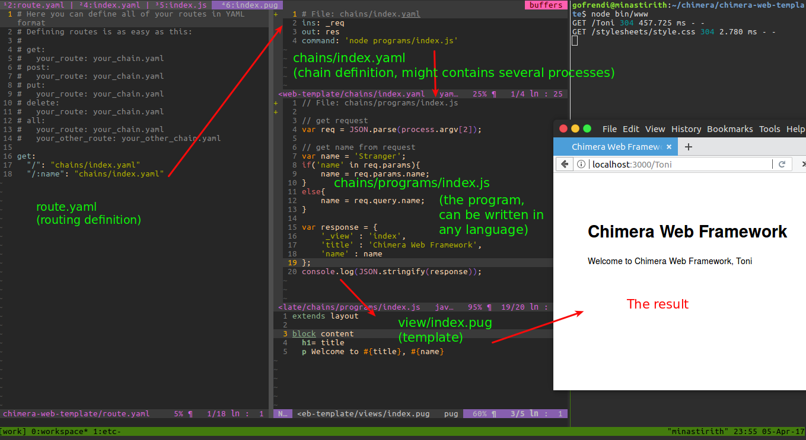

# Chimera Framework

Chimera-framework is a nodejs based framework that let you write any task in any language, and combine them for a greater good.

# Motivation

* Most (if not all) programming languages support command line interface

    Perl, python, php, ruby, haskell, javascript, c, java, pascal, R, and even matlab (See http://stackoverflow.com/questions/6657005/matlab-running-an-m-file-from-command-line) are supporting command line interface (CLI). Through CLI, different programs can communicate to each others. Chimera-framework provide mechanism to store global variables and to orchastrate the programs into a single flow.

* Some programming languages are better at some cases while other are excelled at other cases

    You might love PHP from the bottom of your heart, but it doesn't change the fact that doing heavy-statistic computation in R is easier. Rather than trying to make PHP do what R do, it is more easier to just use R instead.

* Atomic process

    Unix has a great philosophy. It encourage programmers to build a single program to do a single task. Nowadays, people try to make one thing to rule out everything. This might sounds good at first, but the effort will be futile. It is better to keep everything simple and combine those simple process to achieve a greater good.

* Scalability

    By creating independent simple programs, you can make a lot of possibility. There is a hero in DOTA named Invoker that can combine his orbs to activate 10 different abilities (http://dota2.gamepedia.com/Invoker#Invoked_abilities). Rather than building a monolithic program that won't scale, it is better to make simple programs, and combine them as you need.

* Less language migration

    Sometime you need a certain feature that is only available in an esoteric-new-programming-language. You learn the language, convert all your old projects into this new language, and loosing the meaning of life. Just never do that anymore. Chimera framework goal is to let you write any task in any language, and combine them to achieve a greater good.


# Installation

* From source (require `git`)

```sh
git clone git@github.com:goFrendiAsgard/chimera.git
npm install
npm link
```
* Using npm

```sh
npm install --global chimera-framework
```

# Prerequisites

* nodejs
* npm
* any programming languages you want to use

# Is it working?

You can run the test case by running `npm test`. The test require `python`, `php`, and `java` to be already installed.

# Usage (command line)

## Using YAML-chain File

Basically you can invoke your YAML chain file by using this command:

```sh
chimera your-chain-file.yaml [input1 [input2 [input3 ...]]]
```

In the next section you will see how to write a YAML-chain file

### Single process

A chain should contains at least three components. Inputs, command, and output.
For single process, the YAML syntax is quite straight-forward.

```yaml
# filename: add.yaml
ins: a, b
out: c
command: node add.js
```

You can invoke the chain by performing `chimera add.yaml 5 6`. Assuming you `add.js` works correctly, you should see `11` as result.
If you don't define `out` element, `_ans` will be used by default.

Chimera also provide some syntactic sugar for your convenience. The above example can also be written as:


```yaml
# Now, we put ins and out into the command, separated by ->
# The format is: [input] -> [process] -> output
command: (a,b) -> node add.js -> c
```

if not specified, the out parameter is default to `_ans`

```yaml
ins: a, b
command: node add.js
```

You can even write this:
```yaml
command: (a, b) -> node add.js
```

or even this:

```yaml
(a, b) -> node add.js
```

### Process control (branch and loop)

Sometime your process contains several simple logic (i.e: loop and branch). Please look at this example:

```yaml
# control.yaml
vars : 
    delta : 1
ins : a
out : a
series :
  # First process
  - if : a < 10
    command : (a, delta) -> node programs/add.js -> a
    while : a < 8
  # Second process
  - if : a > 10
    command : (a, delta) -> node programs/substract.js -> a
```

In the example, we create a global variable named `delta`. The value is `1`. It can be changed later by the processes. But, for this example, we won't do any changes to `delta`'s value. Instead, we will change the value of `a`

We have two proceesses that run sequentially (you can also use `parallel` instead of `series`, it will be discussed in the next section).

The first process (`(a, delta) -> node programs/add.js -> a`) take `a` and `delta` as inputs. The output will then saved in global variable `a`, so that it can be used later. Chimera will execute this process only if `a < 10`. The process will then executed repeatedly while `a < 8`

Once the first process completed (or ignored in case of the initial condition doesn't met), the second process (`(a, delta) -> node programs/substract.js -> a`) will be executed. The second process will only be executed if `a > 10`.

The process above is logically equal to this pseudo-code (well, actually this is Python):

```python
delta = 1
a = input()

# First process
if a < 10:
    # Well, it is actually do-while,
    # Python just strangely doesn't have do-while
    # so here we go...
    while True:
        a = read_output_of('node programs/add.js ' + a + ' ' + delta)
        if not (a<8):
            break

# Second process
if a > 10:
    a = read_output_of('node programs/substract.js ' + a + ' ' + delta)

# now, show the output
print a
```

__Note:__ Use this feature with care. Don't over do it. For a more complex logic-control, please put it on your program.

### Parallel execution

Let's consider you have several programs written in Python, Java, PHP, and Javascript. Each of them takes 2 arguments, do simple arithmetic operation, and return a single output. Given `a` and `b`, you want to calculate `((a+b) * (a-b)) + a`.

You can write the process as follow:

```
f = ((a+b) * (a-b)) + a
```

You can then divide this process into several sub-processes:
```
Process 1: c = a + b
Process 2: d = a - b
Process 3: e = c * d
Process 4: f = e + a
```

Process 1 and process 2 will be executed in parallel since they are independent to each other. You don't need to solve process 1 in order to do process 2 and vice versa.

After Process 1 and process 2 finished, process 3 and process 4 should be executed in serial.
Process 3 depend on both process 1 and 2, and process 4 depend on process 3


```yaml
# chain-minimal.yaml
ins: a,b
out: f
verbose: false
series:
  # Process One & Two
  - parallel:
      # Process 1 (Python)
      - a, b -> python programs/add.py -> c
      # Process 2 (Java, thus needs compilation)
      - series:
          - chimera-eisn Substract.java Substract.class javac programs/Substract.java
          - a, b -> java -cp programs Substract -> d
  # Process 3 (PHP)
  - c, d -> php programs/multiply.php -> e
  # Process 4 (Javascript)
  - e, a ->node programs/add.js -> f
```
You can execute the chain by invoking: 

```sh
chimera chain-minimal.yaml 5 1
``` 

This will give you `29` since  `((5+1) * (5-1)) + 5 = 29`

__Verbosity:__ Chimera also allows you to see the whole process log. This is useful for benchmarking.
To see the process log, you need to change `verbose: false` into `verbose: true`. If the key is not exists, you can add it.

Below is the log example of previous process in order to let you see if the process is really parallel

```sh
gofrendi@minastirith:~/chimera$ chimera tests/chain-minimal.yaml 5 1
[INFO] START PROCESS [python programs/add.py "5" "1"] AT    : 57,267,581,140,268
[INFO] START PROCESS [chimera-eisn Substract.java Substract.class javac programs/Substract.java] AT    : 57,267,600,777,741
[INFO] END PROCESS   [python programs/add.py "5" "1"] AT    : 57,267,621,802,911
[INFO] PROCESS       [python programs/add.py "5" "1"] TAKES : 40,613,652 NS
[INFO] STATE AFTER   [python programs/add.py "5" "1"]       : {"a":5,"b":1,"c":6}
[INFO] END PROCESS   [chimera-eisn Substract.java Substract.class javac programs/Substract.java] AT    : 57,267,702,087,331
[INFO] PROCESS       [chimera-eisn Substract.java Substract.class javac programs/Substract.java] TAKES : 101,288,225 NS
[INFO] STATE AFTER   [chimera-eisn Substract.java Substract.class javac programs/Substract.java]       : {"a":5,"b":1,"c":6,"_ans":""}
[INFO] START PROCESS [java -cp programs Substract "5" "1"] AT    : 57,267,703,642,875
[INFO] END PROCESS   [java -cp programs Substract "5" "1"] AT    : 57,267,817,048,351
[INFO] PROCESS       [java -cp programs Substract "5" "1"] TAKES : 113,360,360 NS
[INFO] STATE AFTER   [java -cp programs Substract "5" "1"]       : {"a":5,"b":1,"c":6,"_ans":"","d":4}
[INFO] START PROCESS [php programs/multiply.php "6" "4"] AT    : 57,267,818,154,108
[INFO] END PROCESS   [php programs/multiply.php "6" "4"] AT    : 57,267,857,071,186
[INFO] PROCESS       [php programs/multiply.php "6" "4"] TAKES : 38,877,463 NS
[INFO] STATE AFTER   [php programs/multiply.php "6" "4"]       : {"a":5,"b":1,"c":6,"_ans":"","d":4,"e":24}
[INFO] START PROCESS [node programs/add.js "24" "5"] AT    : 57,267,857,806,195
[INFO] END PROCESS   [node programs/add.js "24" "5"] AT    : 57,267,948,281,977
[INFO] PROCESS       [node programs/add.js "24" "5"] TAKES : 90,429,904 NS
[INFO] STATE AFTER   [node programs/add.js "24" "5"]       : {"a":5,"b":1,"c":6,"_ans":"","d":4,"e":24,"f":29}
29
```

As you see, the second process (`[chimera-eisn Substract.java Substract.class javac programs/Substract.java]`) had been started without waiting the first process (`[python programs/add.py "5" "1"]`) finished.

`chimera-eisn` is a tool to execute a command (the third parameter) only if the source file (first parameter) modification time is newer than the destination file (second parameter) modification time

### Nested variables

The best and worst part of Javascript object is that you can add any key without any need to define structure. Chimera's global variable is actually a big javascript object.

Suppose you have variable `a`, you can then access `a.name`, `a.address` etc.

The following YAML file show you how a nested variable can be used.

```yaml
ins: a, b
out: c
vars:
    tmp: 
        x: 3
        z: 5
verbose: false
series:
    - echo "{\"x\":4, \"y\":{}}" -> tmp
    - parallel:
        - series: 
            - (a, b) -> node programs/add.js -> tmp.y.addResult
            - (tmp.y.addResult, tmp.x) -> php programs/multiply.php -> tmp.y.addResult
        - series:
            - (a, b) -> node programs/substract.js -> tmp.y.substractResult
            - (tmp.y.substractResult, tmp.x) -> php programs/multiply.php -> tmp.y.substractResult
    - (tmp.y.addResult, tmp.y.substractResult) -> php programs/multiply.php -> c
```
Please observe each state of the program

```sh
gofrendi@minastirith:~/chimera$ chimera tests/chain-complex-vars.yaml 10 11
[INFO] START PROCESS [php programs/echo.php "{\"x\":4, \"y\":{}}"] AT    : 57,939,071,995,102
[INFO] END PROCESS   [php programs/echo.php "{\"x\":4, \"y\":{}}"] AT    : 57,939,119,742,255
[INFO] PROCESS       [php programs/echo.php "{\"x\":4, \"y\":{}}"] TAKES : 47,689,756 NS
[INFO] STATE AFTER   [php programs/echo.php "{\"x\":4, \"y\":{}}"]       : {"tmp":{"x":4,"y":{}},"a":10,"b":11}
[INFO] START PROCESS [php programs/add.php "10" "11"] AT    : 57,939,122,782,058
[INFO] START PROCESS [php programs/substract.php "10" "11"] AT    : 57,939,125,628,701
[INFO] END PROCESS   [php programs/add.php "10" "11"] AT    : 57,939,155,653,704
[INFO] PROCESS       [php programs/add.php "10" "11"] TAKES : 32,833,697 NS
[INFO] STATE AFTER   [php programs/add.php "10" "11"]       : {"tmp":{"x":4,"y":{"addResult":21}},"a":10,"b":11}
[INFO] START PROCESS [php programs/multiply.php "21" "4"] AT    : 57,939,156,339,845
[INFO] END PROCESS   [php programs/substract.php "10" "11"] AT    : 57,939,158,555,972
[INFO] PROCESS       [php programs/substract.php "10" "11"] TAKES : 32,884,663 NS
[INFO] STATE AFTER   [php programs/substract.php "10" "11"]       : {"tmp":{"x":4,"y":{"addResult":21,"substractResult":-1}},"a":10,"b":11}
[INFO] START PROCESS [php programs/multiply.php "-1" "4"] AT    : 57,939,159,097,322
[INFO] END PROCESS   [php programs/multiply.php "21" "4"] AT    : 57,939,190,612,102
[INFO] PROCESS       [php programs/multiply.php "21" "4"] TAKES : 34,214,893 NS
[INFO] STATE AFTER   [php programs/multiply.php "21" "4"]       : {"tmp":{"x":4,"y":{"addResult":84,"substractResult":-1}},"a":10,"b":11}
[INFO] END PROCESS   [php programs/multiply.php "-1" "4"] AT    : 57,939,192,968,186
[INFO] PROCESS       [php programs/multiply.php "-1" "4"] TAKES : 33,867,169 NS
[INFO] STATE AFTER   [php programs/multiply.php "-1" "4"]       : {"tmp":{"x":4,"y":{"addResult":84,"substractResult":-4}},"a":10,"b":11}
[INFO] START PROCESS [php programs/multiply.php "84" "-4"] AT    : 57,939,193,351,485
[INFO] END PROCESS   [php programs/multiply.php "84" "-4"] AT    : 57,939,223,041,934
[INFO] PROCESS       [php programs/multiply.php "84" "-4"] TAKES : 29,685,070 NS
[INFO] STATE AFTER   [php programs/multiply.php "84" "-4"]       : {"tmp":{"x":4,"y":{"addResult":84,"substractResult":-4}},"a":10,"b":11,"c":-336}
-336
```

## Put YAML-chain format as argument 

You can also put your YAML content directly as argument.

```sh
chimera "command : cal"
```
or simply

```sh
chimera "cal"
```
or even

```sh
chimera "(a) -> cal" 2017
```

which is similar to

```sh
chimera "cal 2017"
```

# Usage (programmatically)

```javascript
const chimera = require('chimera-framework/core');

// without presets
chimera.executeYaml('your-chain-file.yaml', [5, 1], {}, function(output){
    console.log(output);
});


// with presets
chimera.executeYaml('your-chain-file.yaml', {}, {a: 5, b: 1}, function(output){
    console.log(output);
});
```

Function `executeYaml` has 4 parameters, `executeYaml(yamlFile, inputs, presets, callback)`

* `yamlFile` : The chain file in YAML format
* `inputs` : Array of inputs
* `presets` : Initial values of variables
* `callback` : Callback function. Can has three parameters `output`, `success`, `errorMessage`.
    - `output` contains output of the chain
    - `success` contains whether true or false, reflecting whether the chain executed successfully or with error
    - `errorMessage` contains useful error message for debugging purpose

__Note:__ For convenience, Chimera change the working directory to the YAML-chain path. At the end of callback stack, the working directory will be set back. However some problem might occurred if you run another code before the callback finished. Also, for a very rare condition (i.e: You accidentally execute interactive program that will wait user-input forever), the callback might not be executed at all.

# Web Service

Chimera web service will let you run chains in other computer.

To start a chimera web service, you can run `chimera-serve` in the server.

While to use the web service, you can run `chimera-send http://server.com:3000 chain-file.yaml your-first-input your-second-input`.

You can also define TIMEOUT and PUBLISHED directory when running `chimera-serve`. In Unix, you can do this: `TIMEOUT=5000 PUBLISHED=. chimera-serve` to start the web service that only allows client to access chains in current directory. The maximum execution process should be 5000 ms. Otherwise, a request time out will be returned.

Similar mechanism also works when you run `chimera-send`. `TIMEOUT=1000 chimera-send tests/chain-minimal.yaml 4 4` will makes the process only waits for maximum 1 second response from server.

# Utilities

* `chimera-serve` : Look at web service section
* `chimera-send` : Look at web service section
* `chimera-eisn` : Execute if source newer, example: `chimera-eisn program.java program.class javac program.java`

# Web Framework

## Init Project

Run this command to scaffold a web project:

```sh
chimera-init-web myApp
```

The structure of your web application will be:
```sh
▾ myApp/
  ▸ bin/
  ▾ chains/
    ▾ programs/
        sample.responder.py
      core.auth.yaml
      core.configs.yaml
      core.login.yaml
      core.logout.yaml
      core.routes.yaml
      index.yaml
  ▸ node_modules/
  ▾ public/
    ▸ images/
    ▸ javascripts/
    ▸ stylesheets/
      favicon.ico
  ▾ views/
      error.pug
      index.pug
      layout.pug
      sample.respond.pug
      sample.ejs
      sample.pug
    app.js
    config.yaml
    package.json
    route.yaml
```

To run the web server, you can simply move to `myApp` directory and run `npm start`

## Configurations (config.yaml)
* `mongo_url` 
Some core programs are using mongodb.

By default, the value will be `mongodb://localhost/myApp` (depend on your application name).

* `public_path`
The public directory where you put all static resources (javascript, css, images, etc). 

By default, the value will be `public`.

* `favicon_path`
The favicon path. 

By default, the value will be `public/favicon.ico`

* `view_path`
The directory contains view templates (either pug, ejs, or handlebars). 

By default, the value will be `views`

* `error_template` 
The error template.

By default, the value will be `error.pug`

* `session_secret` 
The session secret.

By default, the value will be `mySecret`

* `session_max_age`
Session max age (in seconds).

By default, the value will be `60000`

* `session_save_unitialized`

If this is true, the session will be saved and updated in each request

By default, the value will be `true`

* `session_resave`

By default, the value will be `true`

* `route_chain` 

Route list chain.

The output of the chain should be routes in JSON format.

By default, the value will be `chains/core.routes.yaml`

* `config_chain` 

Config list chain.

The output of the chain should be configs in JSON format.

By default, the value will be `chains/core.configs.yaml`

* `auth_chain` 

Authorization chain, require request.

The output of the chain should be user info in JSON format.

By default, the value will be `chains/core.auth.yaml`

* `migration_chain` 

Migration chain, require config.

The output of the chain should be migration info in JSON format.

By default, the value will be `chains/core.migration.yaml`


## Current Features (Under development)
The already working features:
* File upload (there but not tested)
* Cookies & Session (both, retrieving and writing are working)
* View template (using pug, ejs, and handlebar)
* Configurations 



# Similar projects, inspirations, and how chimera-framework different from them

* Polyglot (https://github.com/sausheong/polyglot)

    In polyglot, single process flow is written in a single programming language. However, you can have a lot of process flows, which each of them can be written in different languages.

    In chimera-framework, singe process can be divided into several sub-processes. Every sub-process can be written in different language.

* Beaker notebook (http://beakernotebook.com/)

    This one is quite similar to chimera-framework. However, the main purpose of beaker is for prototyping and note-taking. In beaker a cell cannot be used in different notebook. You should copy the cell into another notebook in order to use the same piece of code.

* Invoker (http://dota2.gamepedia.com/Invoker)

    A hard-to-master DOTA hero. Not even a framework. Has cool abilities which are combination of 3 orbs.

* Chimera (https://en.wikipedia.org/wiki/Chimera_(mythology))

    Legendary creature. Combination of goat, lion, and snake.
