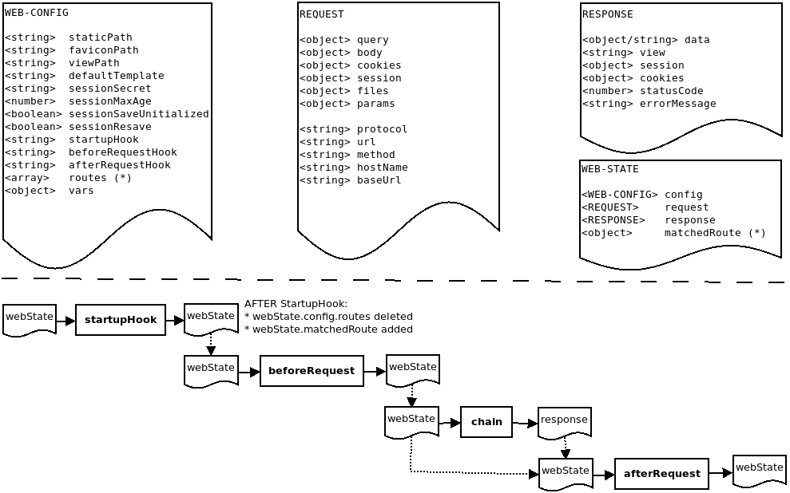
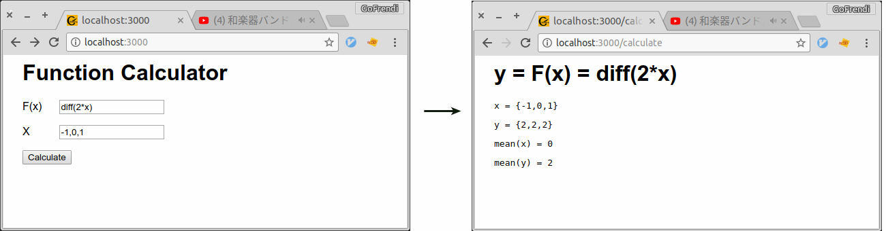

<h1 align="center">Chimera-Framework</h1>

<div align="center">
  
</div>
<br />
<div align="center">
  <strong>Language Agnostic Framework for Stand-alone and Distributed Computing</strong>
</div>
<br />

[](https://standardjs.com)
[](https://codecov.io/gh/goFrendiAsgard/chimera-framework)

Chimera-Framework is a language agnostic framework for standalone and distributed computing. Chimera-Framework is written in `Node.Js`. As a component based software engineering framework, Chimera-Framework allows you to orchestrate several components to achieve a greater goal. The components can be written in any programming language. Executable binary file can also act as component.

# Why Chimera-Framework?

* __Programming Language Diversity:__ Some programming language are good at machine learning. Some others are good at statistics or web development. Creating a website with some machine-learning/statistics feature will lead you to a soon-to-be-regret decision. Chimera-Framework solve this by let you choose the best programming language for each task.

* __CLI Support in Most Programming Language:__ Most programming language supporting command line interface. So, rather than inventing a new bridging interface, Chimera-Framework simply use this already-popular-and-common interface. Thus, you don't need to learn something new in order to write your component.

* __Technology Migration in Tight Deadline is Painful:__ In software development, there is one single hell named vendor-lock. And to make it worse, some frameworks (or even programming languages) can suddenly fade away from the market. Chimera-Framework help you prevent this by let you develop component-based software. So, if your components suddenly doesn't work due to deprecation or anything, you can just simply drop in a new replacement without any need to rewrite the entire software.

# Installation

__Using npm__ You should have `Node.Js` and `npm` installed. This method is recommended for Chimera-Framework user:
```sh
npm install --global chimera-framework
```

__Using git__ You should have `Node.Js`, `npm`, and `git client` installed. This method is recommended for Chimera-Framework tester/developer/contributor:
```sh
npm install --global standard nyc
git clone git@github.com:goFrendiAsgard/chimera-framework.git
cd chimera-framework
npm install --global
npm link
```

# Update

Using npm:
```
npm update --global chimera-framework
```

Using git
```sh
cd chimera-frameowork
git pull origin master
npm install --global
npm link
```

# Dependencies

* Node.Js
* npm
* Interpreters/Compilers, depend on programming language you use.

# Testing

To perform the test, you can invoke `npm test`. A `g++` compiler is required for some test-case.

# Example

## Stand-Alone-Computing

Given `y = f(x) = integrate(2*x)` and `x = {-2, -1, 0, 1, 2, 3}`, A client ask you to make a program to calculate:

* `y`
* `mean of x`
* `mean of y`

The user should be able to change the value of `x` and `f(x)` as needed.

Suppose you are a `Node.Js` developer, and you mainly work with Javascript. You know how to do most thing in `Javascript`, but you can't find any `npm` package that can solve `integral` problem as good as [Sympy](http://www.sympy.org/en/index.html) which is a `Python` package.

You can learn `Python` in a day or two, but the deadline is tomorrow and you don't want to waste your time learning a new programming language *(__PS:__ This is just a simple use-case, in real life, I love `Python` and I will recommend you to try this awesome language, especially if you do a lot of machine-learning thing)*

Your program should contains at least two inputs:
* `statement`: a string containing the mathematical formula of `f(x)`.
* `x`: an array containing the data.

You want to calculate the value of `y` by using `Python` because that is the only one to use `sympy` and you don't have enough time to create the same thing in `Javascript`

But, to calculate `mean of x` and `mean of y` you want to use `Javascript`. You are pretty sure that you only need two beautiful `Javascript` code in order to get the `mean` of an array. *(__PS:__ Yes, Python can do the same, but for now, let's pretend you don't know. Remember, you are a Javascript developer, and you have snake-phobia)*

### First Problem: calculate y

First of all, you make a `Python` script to solve the `f(x)` and get the value of `y`. You name the script as `function.py` and the script is as follow:

```Python
import sys, json
from sympy import *

def f(statement, data):
    x = symbols('x')
    fn = str(eval(statement))
    y = []
    for x in data:
        x = float(x)
        y.append(eval(fn))
    return y

if __name__ == '__main__':
    statement = sys.argv[1]
    data = json.loads(sys.argv[2])
    print(json.dumps(f(statement, data)))
```

Someone told you that `integrate(2*x)` is `x^2`. By using this information, you know that if `y = f(x) = integrate(2*x) = x^2` and `x = {-2, -1, 0, 1, 2, 3}`, then `y` must be `{4, 1, 0, 1, 4, 9}`.

Just to make sure that your program is correct, you then invoke this in your `terminal`:
```bash
gofrendi@minastirith:~$ python function.py "integrate(2*x)" "[-2,-1,0,1,2,3]"
[4, 1, 0, 1, 4, 9]
```

And wow, it works. You don't really know how, but it works and it makes you happy :). *(__PS:__ Don't feel bad if you don't understand how the code works, I'm a computer engineering teacher, and I don't know how sympy exactly works. For now it's just magical, let's inspect it later)*

### Second Problem: calculate mean

Now, you are ready to do the next step. Calculate mean of an array. So, you make a `Javascript` code, name it as `mean.js`, and write this:

```Javascript
module.exports = mean

function mean (data) {
  let total = data.reduce((total, num) => { return total + num })
  return parseFloat(total) / data.length
}

if (require.main === module) {
  let data = JSON.parse(process.argv[2])
  console.log(mean(data))
}
```

You are pretty sure it's going to work, and it's not as magical as solving the integral. But as you always happy seeing your program works, you open your terminal, and type this:
```bash
gofrendi@minastirith:~$ node mean.js "[4,1,0,1,4,9]"
3.1666666666666665
```
And again, you got the right answer.

### Combine them

Now you have a working `Python` script and a working `Javascript` code. You want them to works together to solve your problem. So you make a `CHIML` script. This `CHIML` stands for `Chimera Markup Language` which is just a simple super-set of `YAML`.

You name the `CHIML` script `calculate.chiml` and the content is as follow:

```yaml
ins: statement, x
out: output
do:
  - parallel:

    # 1. get xMean
    - |(x) -> node mean.js -> xMean

    # 2. get y and yMean
    - do:
      - |(statement, x) -> python function.py -> y
      - |(y) -> node mean.js -> yMean

  # 3. show the output
  - |({statement, x, xMean, y, yMean}) -> {$.util.getInspectedObject} -> output
```

You see that the first process (get xMean) and second process (get y and yMean) are independent to each other. Thus, better to run in parallel. However, the third process (show the output) should only be executed once the first and second process finished.

We will cover what actually happened here and what the `CHIML` is about. But first of all, let's confirm that this script is working. You open your terminal again, and invoke this command:

```bash
gofrendi@minastirith:~$ chimera calculate.chiml "integrate(2*x)" "[-2,-1,0,1,2,3]"
{ statement: 'integrate(2*x)',
  x: [ -2, -1, 0, 1, 2, 3 ],
  xMean: 0.5,
  y: [ 4, 1, 0, 1, 4, 9 ],
  yMean: 3.1666666666666665 }
```

Perfect. It works... But how?

### CHIML Script

`CHIML` is a superset of `YAML`. So, any valid `YAML` is also a valid `CHIML`. And as `YAML` itself is a superset of `JSON`, any valid `JSON` is also a valid `CHIML`

The only thing that make `CHIML` diferent from `YAML` is you are allowed to write any string after block delimiter (`|` and `>`). Under the hood, this `|someString` will be translated into `"someString"`. If the string contains `"`, it is going to be automatically escaped, so you don't need to worry about it.

`CHIML` should contains one single `chain`. A `chain` is a structure defining `input`, `output`, and `process`. However, a `chain` can has another `chains` as it's child. In this sense, `CHIML` script is a big tree schema to define your entire process.

There are several ways to write a `single chain`:

* Long form
```yaml
ins: input1, input2
out: output
do: command
```

* Short form
```yaml
(input1, input2) -> command -> out
```

* Short form with Javascript function instead of CLI command
```yaml
(input1, input2) -> {javascript-function} -> out
```

* Short form with Javascript function instead of CLI command (The last argument of the function must be Node-Callback)
```yaml
(input1, input2) -> [javascript-function-with-callback] -> out
```

* Short form with Javascript promise instead of CLI command
```yaml
(input1, input2) -> <javascript-promise> -> out
```

A `chain` can contains another `chains` as it's child. These kind of `chain` is also known as `nested chain`, and this is how we write a nested chain:

```yaml
ins: input1, input2
out: output
do:
  - subChain1
  - subChain2
  - subChain3
```

If the `subChains` should be executed in parallel, a `parallel` keyword should be used instead of `do`:

```yaml
ins: input1, input2
out: output
parallel:
  - subChain1
  - subChain2
  - subChain3
```

Chimera-Framework also provide some built-in Javascript functions under `$` namespace. `$.util.getInspectedObject` for example, will inspect and object and return a human-readable string representing the object.

__TODO:__ add link to complete CHIML grammar documentation

### The Data Flow

Our `calculate.chiml` in the previous case, can be visualized as follow:


Technically, whenever a `CHIML` script executed, a `Javascript` object will be created and store some global variables which are accessible from every process. In this sense, `calculate.chiml` can also be visualized as follow:


### Make Use of Node.Js Module For Better Performance

As Chimera-Framework is written in Node.Js, loading a Node module in your CHIML script is going to be faster than invoking `node` command. As our `mean.js` export the `mean` function (ie: `module.exports = mean`), we can modify our CHIML script into:

```yaml
ins: statement, x
out: output
do:
  - parallel:

    # get xMean
    - |(x) -> {$.loadJs(_chain_cwd + 'mean.js')} -> xMean

    # get y and yMean
    - do:
      - |(statement, x) -> python function.py -> y
      - |(y) -> {$.loadJs(_chain_cwd + 'mean.js')} -> yMean

  # get the output
  - |({statement, x, xMean, y, yMean}) -> {$.util.getInspectedObject} -> output
```

Notice that `$.loadJs` will load a function defined in Node.Js Module, so that it can be used in your CHIML script.

## Distributed-Computing

So, your stand-alone program is working perfectly now. However, you have to do the same thing using a low-spec mini-computer. You have try to run your CHIML script in this mini-computer, but it takes 15 minutes to do the calculation.

You think of the solution, and you come up with a briliant idea. You can create an API server in your computer, so that your mini-computer can send the request to the server and get the result.

Chimera-Framework has a built in solution for that. Suppose your server can be accessed as `http://minastirith.com`, then in your server, you simply invoke this command:

```
chimera-serve
```

Now, in your mini-computer, you create a script named `remote-calculate.chiml`:

```
ins: statement, x
out: output
vars:
  remoteUrl: 'http://minastirith.com:3000'
  chain: 'calculate.chiml'
do:

  - parallel:
    - (remoteUrl, chain, statement, x) -> [$.send] -> fx
    - (remoteUrl, chain, 'diff(' + statement + ')', x) -> [$.send] -> diff_fx
    - (remoteUrl, chain, 'integrate(' + statement + ')', x) -> [$.send] -> int_fx

  - (fx, '\n', diff_fx, '\n', int_fx) -> {$.concat} -> output
```

Now, you can calculate `f(x)` as well as `diff(f(x))` and `integrate(f(x))` in parallel by simply invoke:

```bash
gofrendi@minastirith:~$ chimera multi-calculate.chiml "x**2" "[-2,-1,0,1,2,3]"
{ statement: 'x**2',
  x: [ -2, -1, 0, 1, 2, 3 ],
  xMean: 0.5,
  y: [ 4, 1, 0, 1, 4, 9 ],
  yMean: 3.1666666666666665 }
{ statement: 'diff(x**2)',
  x: [ -2, -1, 0, 1, 2, 3 ],
  xMean: 0.5,
  y: [ -4, -2, 0, 2, 4, 6 ],
  yMean: 1 }
{ statement: 'integrate(x**2)',
  x: [ -2, -1, 0, 1, 2, 3 ],
  xMean: 0.5,
  y: [ -3, -1, 0, 0, 2, 9 ],
  yMean: 1.1666666666666667 }
```

`$.send` is a Chimera-Framework's built-in function to send the request to the server. The first and second parameters of `$.send` should be the url and the chain name respectively. And the last parameter of `$.send` should be the callback (handled automatically by Chimera-Framework)

`$.concat` is also another Chimera-Framework's built in function. It receive string parameters and concat it into a single string.

### The Data Flow

Our `remote-calculate.chiml` in the previous case, can be visualized as follow:


## Web App

Although CLI Application can be useful in a lot of cases, some people might be intimidated by it's interface. They prefer to click and tap on the screen rather than type some alien words in the terminal. In this case, creating a web application can be an interesting solution.

Chimera-Web-App is based on [Express.Js](http://expressjs.com/), a de-facto web framework for Node.Js.

In Chimera-Web-App, you can define several `hook` and `chains` to transform a user's request into desired response. This process is shown as follow:



Now, let's convert your previous `CHIML` workflow into a web application. We want to expose two URL. The first URL `http://localhost:3000/` act as entry point page. In this page, user will be able to input the value of `f(x)` and `x`. After clicking the `calculate` button, a `post` request will be sent to the second URL `http://localhost:3000/calculate`, and the calculation result will be shown to the user.



First of all, you need to create the directory structure

```
▾ chains/
  ▾ components/
      function.py
      mean.js
    calculate.chiml
    form.chiml
    hook-startup.chiml
▾ public/
  ▾ css/
      style.css
    favicon.ico
▾ views/
    error.ejs
    form.ejs
    result.ejs
  index.js
```

In your Chimera-Web-App, `index.js` will act as your entry point. The content of `index.js` is as follow:

```javascript
const path = require('path')
const web = require('chimera-framework/lib/web.js')
const port = process.env.PORT || 3000

const webConfig = {
  'startupHook': path.join(__dirname, 'chains/hook-startup.chiml'),
  'verbose': 3
}
let app = web.createApp(webConfig)
module.exports = app

if (require.main === module) {
  app.listen(port, function () {
    console.error('Start at port ' + port)
  })
}
```

After importing `path`, `chimera.web`, and determining default `port`, you need to define the `webConfig`. This `webConfig` is merely an object containing several configuration values. For now, there are only two configuration, `startupHook` and `verbose`. The `startupHook` configuration is refering to a CHIML script to override the configurations as well as define accessible routes. On the other hand, `verbose` configuration defining verbosity level (i.e: how much log is shown in the console).

The `web.createApp` function will return an Express.Js `app` with some middlewares adjusted to Chimera-Framework.

You also need to define webConfig and route in `chains/hook-startup.chiml` as follow:

```yaml
ins: webState
out: webState
parallel:

  # define routes
  - ins:
    - [
        {"route":"/calculate", "method":"post", "chain":_chain_cwd+"calculate.chiml"},
        {"route":"/", "method":"all", "chain":_chain_cwd+"form.chiml"},
      ]
    out: webState.config.routes

  # define other configurations
  - (_chain_cwd+"../public") --> webState.config.staticPath
  - (_chain_cwd+"../public/favicon.ico") --> webState.config.faviconPath
  - (_chain_cwd+"../views") --> webState.config.viewPath
  - (_chain_cwd+"../views/error.ejs") --> webState.config.errorTemplate
```

Here you define two routes (`/calculate` to `calculate.chiml` and `/` to `form.chiml`) and several configurations (`staticPath`, `faviconPath`, `viewPath`, and `errorTemplate`). The configurations are defining directory path of your static resource, favicon, views, and error template.

The content of `form.chiml` is merely:

```yaml
|({"view":"form.ejs"}) --> response
```

Basically, this `CHIML` script do nothing but set response's view to `form.ejs`. The content of `form.ejs` itself is a simple `HTML` to show an entry form:

```html
<head>
  <link rel="stylesheet" href="css/style.css">
</head>
<body>
  <h1>Function Calculator</h1>
  <form action="/calculate" method="post">
    <p>
      <label>F(x)</label>
      <input name="statement" placeholder="Your mathematical function" value="integrate(2*x)"></statement>
    </p>
    <p>
      <label>X</label>
      <input name="x" placeholder="Your data" value="-2, -1, 0, 1, 2, 3"></statement>
    </p>
    <p>
      <button name="submit">Calculate</button>
    </p>
  </form>
</body>
```

The content of `calculate.chiml` is a bit more complicated since it needs to take user's input, do some preprocessing then run both `function.py` and `means.js` in the correct order. The content of `calculate.chiml` is as follow:

```yaml
ins: webState
out: response
do:
  - webState.request.body --> post
  - ('[' + post.x + ']') --> x
  - parallel:

    # get xMean
    - |(x) -> {$.loadJs(_chain_cwd+'components/mean.js')} -> xMean

    # get y and yMean
    - do:
      - |(post.statement, x) -> python components/function.py -> y
      - |(y) -> {$.loadJs(_chain_cwd+'components/mean.js')} -> yMean

  # assemble output
  - |({"x":x, "y":y, "xMean":xMean, "yMean": yMean, "statement": post.statement}) --> response.data
  - |("result.ejs") --> response.view
```

The script tells Chimera-Framework to send `x`, `y`, `xMean`, `yMean`, and `statement` to `result.ejs` so that it can show the desired result. Below is the content of `result.ejs`:

```html
<head>
  <link rel="stylesheet" href="css/style.css">
</head>
<body>
  <h1><%= 'y = F(x) = ' + statement %></h1>
  <pre><%= 'x = {' + x + '}' %></pre>
  <pre><%= 'y = {' + y + '}' %></pre>
  <pre><%= 'mean(x) = ' + xMean %></pre>
  <pre><%= 'mean(y) = ' + yMean %></pre>
</body>
```

__NOTE:__ The source code used in the examples are available [here](/example)

# API

Chimera-Framework has several API. The API are accessible from any Node.Js programs. To use the API, you need to add this to your Node.Js application:

```javascript
const chimera = require('chimera-framework')
```

Below are the list of available API

* chimera.cmd
* chimera.core
* chimera.coreChimlParser
* chimera.coreDollar
* chimera.corePreprocessor
* chimera.eisn
* chimera.mongo
* chimera-sender
* chimera-server
* chimera-util
* chimera-web

__TODO:__ create documentation for this

# FAQ (Frequently Asked Question)

Have some questions?  Open an [issue](https://github.com/goFrendiAsgard/chimera-framework/issues) or click the [FAQ](doc/faq.md).
