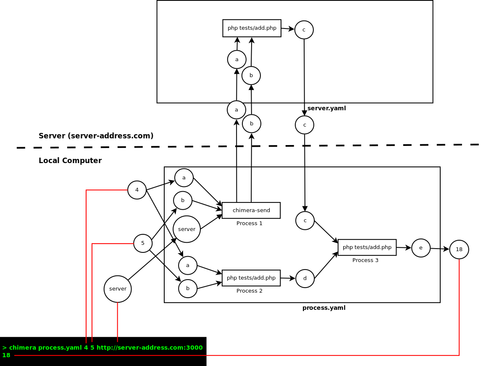
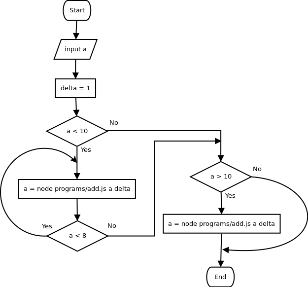

# Advance Example

## Distributed Process

In the previous example, the sub-processes (Process 1, Process 2, and Process 3) was executed in a single computer.

Chimera-framework can also run in distributed scenario. Suppose Process 1 should be run in the server, and Process 2 should run in the client, we should divide the process into 4 steps.




Before we dive into the steps, we should prepare two more files.

```yaml
# server.yaml
(a , b) −> php tests/add.php −> c
```

`server.yaml` contains only a single process (`tests/add.php`). It takes `a` and `b` as inputs, and return `c` as output. Executing `chimera server.yaml 4 5` will return `9`.

```yaml
# process.yaml
ins: a, b, server
out: e
verbose : true
series :
    − parallel :
        # Process 1
        − (server, 'server.yaml', a, b)−> chimera−send −> c
        # Process 2
        − (a, b) −> php programs/add.php −> c
    # Process 3
    − (c, d) −> node programs/add.js −> e
```

This YAML chain file is basically similar to our previous example. The only difference is on Process 1 definition. This process takes 4 inputs. The first one is server address, the second one is server's YAML chain, and the last two inputs will be sent `server.yaml`'.

`chimera-send` is a utility to execute YAML chain file in other computer. Its first two parameters are `server address` and `server YAML chain file` respectively.

After preparing the files, we should proceed with these 4 steps:


* __Server side preparation__: In the server side, we need to provide:
    - `tests/add.php`
    - `server.yaml`

* __Server side execution__: After server preparation completed, we need to serve `server.yaml`, so that it is accessible from the network. In order to do this, we can execute `chimera-serve`, a utility to serve chains in the server:

```sh
chimera-serve
```

* __Client side preparation__: In the client side, we need to provide:
    - `tests/add.php`
    - `tests/add.js`
    - `process.yaml`

* __Client side execution__: After client preparation completed, we can then execute:

```sh
chimera process.yaml 4 5 http://server-address.com:3000
```

## Shorthand

Let's look at this example:

```yaml
# filename: add.yaml
ins: a, b
out: c
command: node add.js
```

You can invoke the chain by performing `chimera add.yaml 5 6`. Assuming you `add.js` works correctly, you should see `11` as result.
If you don't define `out` element, `_ans` will be used by default.

Chimera also provide some shorthand for your convenience. The above example can also be written as:


```yaml
# Now, we put ins and out into the command, separated by ->
# The format is: [input] -> [process] -> output
command: (a,b) -> node add.js -> c
```

if not specified, the out parameter is default to `_ans`

```yaml
ins: a, b
command: node add.js
```

You can also write the process as:
```yaml
command: (a, b) -> node add.js
```

or even:

```yaml
(a, b) -> node add.js
```

In some situation, your process might be so simple that you only need a single line javascript arrow function instead of a fully stand alone program. In that case, you can do this:

```yaml
(a, b) -> (x,y)=>{return parseFloat(x)+parseFloat(y)}
```

For more comprehensive information regarding anonymous javascript arrow function, please visit [https://developer.mozilla.org/en-US/docs/Web/JavaScript/Reference/Functions/Arrow_functions](https://developer.mozilla.org/en-US/docs/Web/JavaScript/Reference/Functions/Arrow_functions)

## Process control (branch and loop)

Sometime your process contains several simple logic (i.e: loop and branch). Please look at this example:

```yaml
# control.yaml
vars :
    delta : 1
ins : a
out : a
series :
  # First process
  - if : a < 10
    command : (a, delta) -> node programs/add.js -> a
    while : a < 8
  # Second process
  - if : a > 10
    command : (a, delta) -> node programs/substract.js -> a
```

In the example, we create a global variable named `delta`. The value is `1`. It can be changed later by the processes. But, for this example, we won't do any changes to `delta`'s value. Instead, we will change the value of `a`

We have two proceesses that run sequentially (you can also use `parallel` instead of `series`, it will be discussed in the next section).

The first process (`(a, delta) -> node programs/add.js -> a`) take `a` and `delta` as inputs. The output will then saved in global variable `a`, so that it can be used later. Chimera will execute this process only if `a < 10`. The process will then executed repeatedly while `a < 8`

Once the first process completed (or ignored in case of the initial condition unmet), the second process (`(a, delta) -> node programs/substract.js -> a`) will be executed. The second process will only be executed if `a > 10`.

The process above is logically equal to this flowchart:



__Note:__ Use this feature with care. Don't over do it. For a more complex logic-control, please put it on your program.

## Nested variable

The best and worst part of Javascript object is that you can add any key without any need to define structure. Chimera's global variable is actually a big javascript object.

Suppose you have variable `a`, you can then access `a.name`, `a.address` etc.

The following YAML file show you how a nested variable can be used.

```yaml
ins: a, b
out: c
verbose: true
series:
    - ('{"x":4,"z":5}') -> php programs/echo.php -> tmp
    - parallel:
        - series:
            - (a, b) -> php programs/add.php -> tmp.y.addResult
            - (tmp.y.addResult, tmp.x) -> php programs/multiply.php -> tmp.y.addResult
        - series:
            - (a, b) -> php programs/substract.php -> tmp.y.substractResult
            - (tmp.y.substractResult, tmp.x) -> php programs/multiply.php -> tmp.y.substractResult
    - (tmp.y.addResult, tmp.y.substractResult) -> php programs/multiply.php -> c
```

```sh
gofrendi@minastirith:~/chimera-framework$ chimera tests/chain-complex-vars.yaml 10 11
[INFO] PROCESS :      php programs/echo.php "{\"x\":4,\"z\":5}"
[INFO] START PROCESS [php programs/echo.php "{\"x\":4,\"z\":5}"] AT    : 50,016,333,516,851
[INFO] END PROCESS   [php programs/echo.php "{\"x\":4,\"z\":5}"] AT    : 50,016,441,246,296
[INFO] PROCESS       [php programs/echo.php "{\"x\":4,\"z\":5}"] TAKES : 107,663,018 NS
[INFO] STATE AFTER   [php programs/echo.php "{\"x\":4,\"z\":5}"] :
        a : 10
        b : 11
        c : ""
        tmp : {"x":4,"z":5}
[INFO] PROCESS :      php programs/add.php "10" "11"
[INFO] START PROCESS [php programs/add.php "10" "11"] AT    : 50,016,443,161,714
[INFO] PROCESS :      php programs/substract.php "10" "11"
[INFO] START PROCESS [php programs/substract.php "10" "11"] AT    : 50,016,447,803,721
[INFO] END PROCESS   [php programs/add.php "10" "11"] AT    : 50,016,484,394,967
[INFO] PROCESS       [php programs/add.php "10" "11"] TAKES : 41,210,854 NS
[INFO] STATE AFTER   [php programs/add.php "10" "11"] :
        a : 10
        b : 11
        c : ""
        tmp : {"x":4,"z":5,"y":{"addResult":21}}
[INFO] PROCESS :      php programs/multiply.php "21" "4"
[INFO] START PROCESS [php programs/multiply.php "21" "4"] AT    : 50,016,484,957,674
[INFO] END PROCESS   [php programs/substract.php "10" "11"] AT    : 50,016,487,877,064
[INFO] PROCESS       [php programs/substract.php "10" "11"] TAKES : 40,039,632 NS
[INFO] STATE AFTER   [php programs/substract.php "10" "11"] :
        a : 10
        b : 11
        c : ""
        tmp : {"x":4,"z":5,"y":{"addResult":21,"substractResult":-1}}
[INFO] PROCESS :      php programs/multiply.php "-1" "4"
[INFO] START PROCESS [php programs/multiply.php "-1" "4"] AT    : 50,016,488,358,786
[INFO] END PROCESS   [php programs/multiply.php "21" "4"] AT    : 50,016,513,545,979
[INFO] PROCESS       [php programs/multiply.php "21" "4"] TAKES : 28,537,199 NS
[INFO] STATE AFTER   [php programs/multiply.php "21" "4"] :
        a : 10
        b : 11
        c : ""
        tmp : {"x":4,"z":5,"y":{"addResult":84,"substractResult":-1}}
[INFO] END PROCESS   [php programs/multiply.php "-1" "4"] AT    : 50,016,519,987,606
[INFO] PROCESS       [php programs/multiply.php "-1" "4"] TAKES : 31,624,752 NS
[INFO] STATE AFTER   [php programs/multiply.php "-1" "4"] :
        a : 10
        b : 11
        c : ""
        tmp : {"x":4,"z":5,"y":{"addResult":84,"substractResult":-4}}
[INFO] PROCESS :      php programs/multiply.php "84" "-4"
[INFO] START PROCESS [php programs/multiply.php "84" "-4"] AT    : 50,016,520,551,138
[INFO] END PROCESS   [php programs/multiply.php "84" "-4"] AT    : 50,016,551,898,639
[INFO] PROCESS       [php programs/multiply.php "84" "-4"] TAKES : 31,342,909 NS
[INFO] STATE AFTER   [php programs/multiply.php "84" "-4"] :
        a : 10
        b : 11
        c : -336
        tmp : {"x":4,"z":5,"y":{"addResult":84,"substractResult":-4}}
-336
```

## Stop Execution

By set `_error` into `true`, you can break the chain execution process. Example:

```yaml
ins: file, content
series:
    - (file, content) -> write-file.yaml -> result
    - if: "!result.success"
      parallel:
        # This will stop the chain execution
        - ()=>{return true} -> _error
        - ()=>{return 'Cannot write to file'} -> _error_message
    # So, if result.success == false, the following process will never be executed
    - some_other_command -> some_variable
```

The simpler way to do this is:

```yaml
ins: file, content
series:
    - ins: file, content
      out: result
      command: write-file.yaml
      error: "!result.success"
      error_message: "Cannot write to file"
    - some_other_command -> some_variable
```

## YAML string as argument

You can also put your YAML content directly as argument.

```sh
chimera "command : cal"
```
or simply

```sh
chimera "cal"
```
or even

```sh
chimera "(a) -> cal" 2017
```

which is similar to

```sh
chimera "cal 2017"
```

# Better performance

Since Chimera-framework is written in Node.Js, there is an internal mechanism to improve performance whenever your `Command` is either Javascript arrow function or Javascript module.

## Arrow function

Using arrow function is very easy. Here is the example:

```yaml
(a,b) -> (x,y)=>{return parseFloat(x)+parseFloat(y)} -> c
```

## Javascript module

To use javascript module as `Command`, you should make sure, your module export a function named `_run`. The last parameter of `_run` should be a callback function.

Here is an example of ideal Javascript module:

```Javascript
// File location: programs/add.js

function add(n1, n2){
    n1 = parseFloat(n1)
    n2 = parseFloat(n2)
    return n1+n2;
}

// executed when imported as module
module.exports = function(a, b, callback){
    let output = add(a,b)
    callback(output)
}

// executed from external command
if(require.main == module){
    var n1 = process.argv[2];
    var n2 = process.argv[3];
    console.log(add(n1, n2));
}
```

Your YAML chain could contains something like this:

```yaml
(a,b) -> node programs/add.js -> c
```

However, to achieve a better performance, you should do this:

```yaml
(a,b) -> [./programs/add.js] -> c
```

## Run another chain as process
