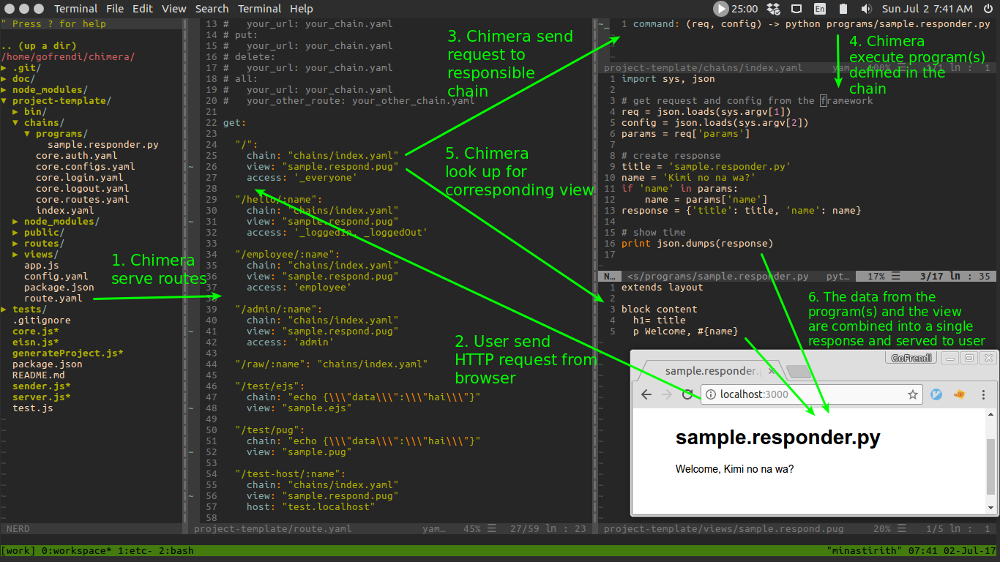

# Web Framework

## Init Project

Run this command to scaffold a web project:

```sh
chimera-init-web myApp
```

The structure of your web application will be:
```sh
▾ myApp/
  ▸ bin/
  ▾ chains/
    ▾ programs/
        sample.responder.py
      core.auth.yaml
      core.configs.yaml
      core.login.yaml
      core.logout.yaml
      core.routes.yaml
      index.yaml
  ▸ node_modules/
  ▾ public/
    ▸ images/
    ▸ javascripts/
    ▸ stylesheets/
      favicon.ico
  ▾ views/
      error.pug
      index.pug
      layout.pug
      sample.respond.pug
      sample.ejs
      sample.pug
    app.js
    config.yaml
    package.json
    route.yaml
```

To run the web server, you can simply move to `myApp` directory and run `npm start`

## Configurations (config.yaml)
* `mongo_url` 
Some core programs are using mongodb.

By default, the value will be `mongodb://localhost/myApp` (depend on your application name).

* `public_path`
The public directory where you put all static resources (javascript, css, images, etc). 

By default, the value will be `public`.

* `favicon_path`
The favicon path. 

By default, the value will be `public/favicon.ico`

* `view_path`
The directory contains view templates (either pug, ejs, or handlebars). 

By default, the value will be `views`

* `error_template` 
The error template.

By default, the value will be `error.pug`

* `session_secret` 
The session secret.

By default, the value will be `mySecret`

* `session_max_age`
Session max age (in seconds).

By default, the value will be `60000`

* `session_save_unitialized`

If this is true, the session will be saved and updated in each request

By default, the value will be `true`

* `session_resave`

By default, the value will be `true`

* `route_chain` 

Route list chain, require webConfig.

The output of the chain should be routes in JSON format.

By default, the value will be `chains/core.routes.yaml`

* `config_chain` 

Config list chain, require webConfig.

The output of the chain should be configs in JSON format.

By default, the value will be `chains/core.configs.yaml`

* `auth_chain` 

Authorization chain, require webConfig and request.

The output of the chain should be user info in JSON format.

By default, the value will be `chains/core.auth.yaml`

* `migration_chain` 

Migration chain, require webConfig.

The output of the chain should be migration info in JSON format.

By default, the value will be `chains/core.migration.yaml`


## Current Features (Under development)
The already working features:
* File upload (there but not tested)
* Cookies & Session (both, retrieving and writing are working)
* View template (using pug, ejs, and handlebar)
* Configurations 



